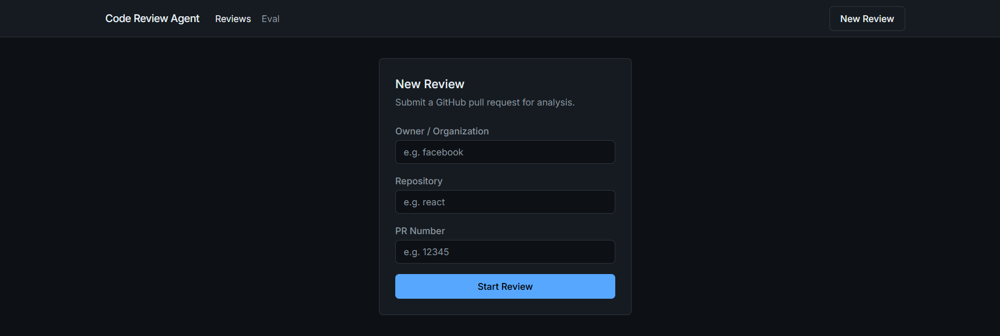
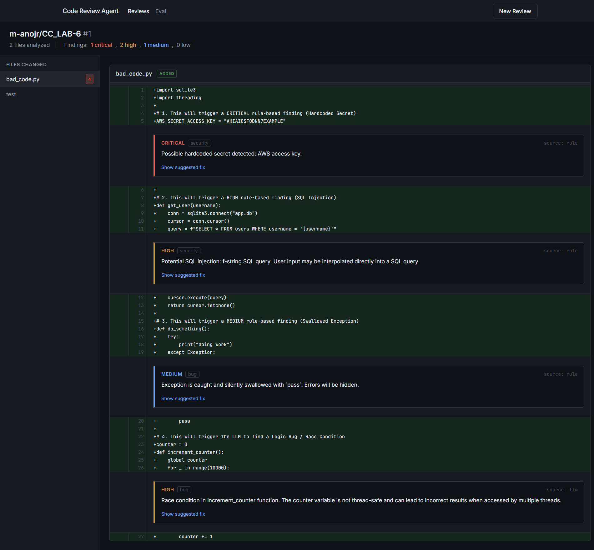
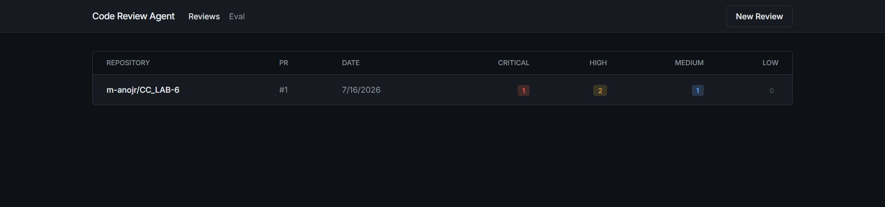
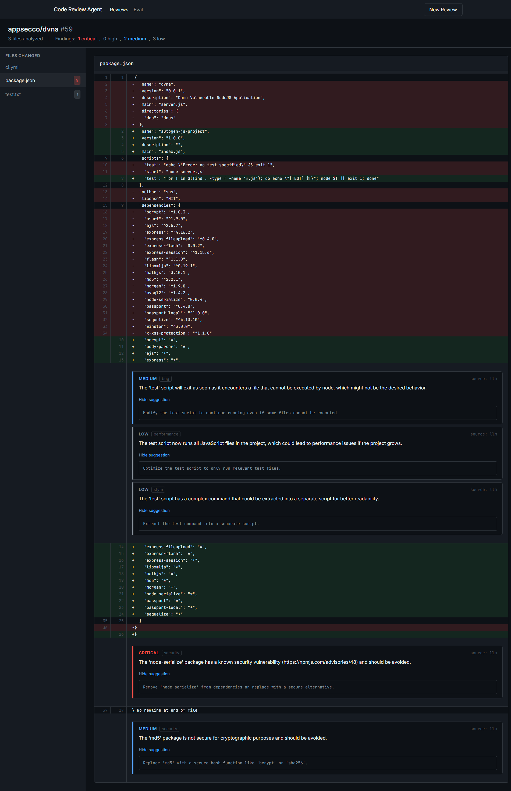
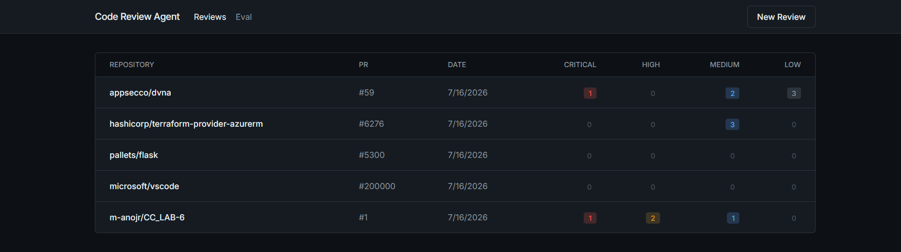
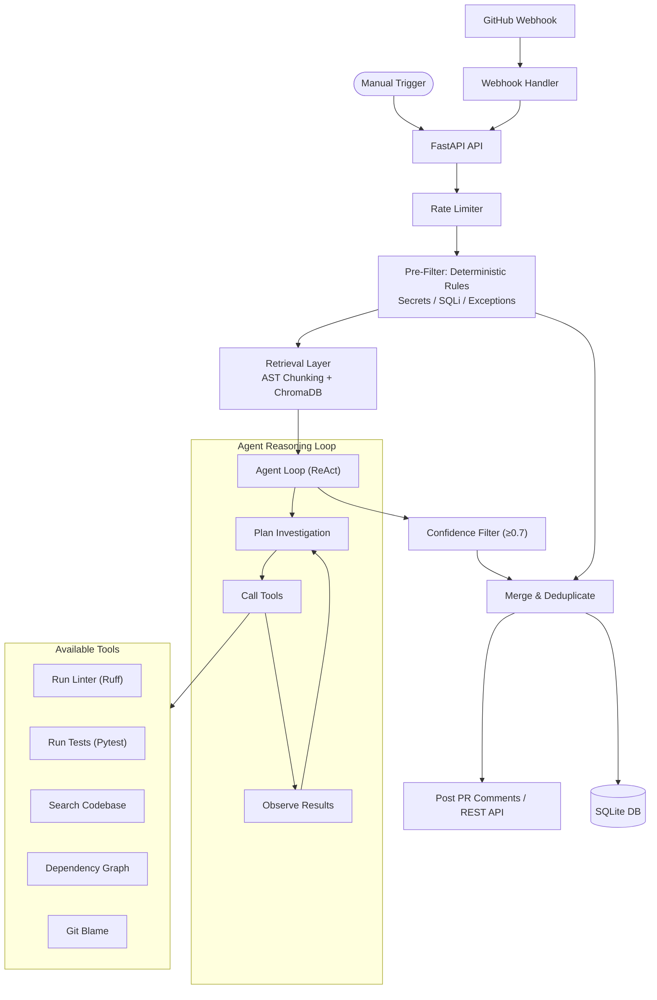

# Agentic AI Code Review Agent

A production-grade code review system that analyzes GitHub pull requests using a **hybrid agentic approach**: deterministic security rules run first for instant, high-precision findings, then a ReAct-style AI agent uses tools (linter, test runner, codebase search, dependency analysis) to perform deep code investigation before producing a verdict.

## Screenshots

| Submit New Review | Code Diff Viewer |
| :---: | :---: |
|  |  |
| **Evaluation Suite** | **Inline AI Findings** |
|  |  |

<br>
<p align="center">
  <b>Reviews Dashboard</b><br>
  
</p>

## Architecture



## Key Features

- **Agentic, not single-shot**: The AI agent plans its investigation, calls tools, and iterates before producing findings
- **Retrieval-augmented**: AST-aware code chunking with ChromaDB vector search pulls in relevant surrounding code
- **Precision-first**: Confidence threshold (default 0.7) drops low-confidence findings — false positives destroy trust
- **Tool-augmented**: Linter, test runner, dependency graph, codebase search, git blame
- **GitHub webhook integration**: Auto-triggers on PR open/update with HMAC signature verification
- **Deterministic pre-filter**: Regex rules for secrets, SQL injection, and exceptions run before the agent (fast, free, 100% precision)
- **Production guardrails**: Rate limiting, cost tracking, prompt injection defense, secret leak prevention, silent failure monitoring

## Tech Stack

| Component | Technology | Why |
|-----------|-----------|-----|
| Backend | FastAPI + Python | Async-native, fast, great ecosystem |
| Agent LLM | Groq (Llama 3.3 70B) | Free tier, fastest inference, tool-use support |
| Fallback LLM | Gemini 2.0 Flash | Google's free tier as backup |
| Vector Store | ChromaDB (embedded) | Zero infrastructure, file-based |
| Embeddings | sentence-transformers | Local, no API cost |
| Frontend | React + Vite + Tailwind | Modern, fast dev experience |
| Database | SQLite (aiosqlite) | Zero-config, sufficient for single-instance |
| Deployment | Docker Compose | One-command deployment |

## Setup and Running

1. Clone the repository
2. Copy `.env.example` to `.env` and fill in your keys:
   - `GITHUB_TOKEN`: Fine-grained PAT with read access to target repos
   - `GROQ_API_KEY`: Primary LLM provider (get free at [console.groq.com](https://console.groq.com))
   - `GEMINI_API_KEY`: Fallback LLM provider
   - `GITHUB_WEBHOOK_SECRET`: (Optional) For webhook integration
3. Start the application:

```bash
docker-compose up --build
```

4. Open `http://localhost:3001` in your browser

## Agent Configuration

| Variable | Default | Description |
|----------|---------|-------------|
| `AGENT_MAX_ITERATIONS` | 5 | Max ReAct loop iterations per file |
| `AGENT_TOKEN_BUDGET` | 32000 | Max tokens per PR review |
| `AGENT_CONFIDENCE_THRESHOLD` | 0.7 | Drop findings below this confidence |

## Webhook Setup

To receive automatic PR reviews via GitHub webhooks:

1. In your repo settings → Webhooks → Add webhook
2. Payload URL: `https://your-domain.com/api/webhook/github`
3. Content type: `application/json`
4. Secret: Same value as `GITHUB_WEBHOOK_SECRET` in `.env`
5. Events: Select "Pull requests"

## Evaluation Suite

The project includes a deterministic evaluation suite testing the engine against 10 Python code fixtures containing known vulnerabilities and clean code.

- Navigate to the `Eval` tab in the web UI
- Metrics: Precision (signal-to-noise), Recall (coverage), F1 Score

## Project Structure

```
backend/
├── app/
│   ├── agent.py          # ReAct agent orchestration loop
│   ├── analyzer.py       # Hybrid analysis engine (rules + agent)
│   ├── config.py         # Centralized configuration management
│   ├── db.py             # SQLite persistence layer
│   ├── github_client.py  # GitHub API integration
│   ├── guardrails.py     # Rate limiting, cost tracking, security
│   ├── main.py           # FastAPI application & endpoints
│   ├── models.py         # Pydantic domain models
│   ├── retrieval.py      # AST chunking + ChromaDB vector search
│   ├── tools.py          # Agent tool implementations
│   ├── webhook.py        # GitHub webhook handler
│   ├── rules/            # Deterministic rule engines
│   │   ├── secrets.py
│   │   ├── sql_injection.py
│   │   └── exceptions.py
│   └── eval/             # Evaluation harness
│       ├── benchmark.py
│       └── fixtures/
frontend/
├── src/
│   ├── components/       # React UI components
│   ├── api.ts            # API client
│   └── types.ts          # TypeScript type definitions
```
